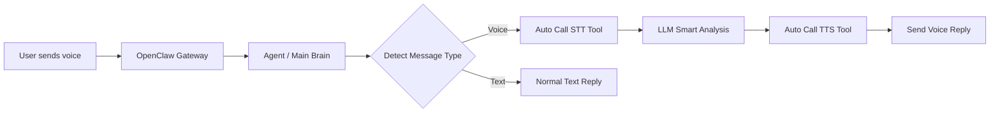

# Voice Chat Bridge (voice-chat)

**语音转文字 (STT) 和文字转语音 (TTS) 的通用工具包**，专为 OpenClaw 集成设计。
**Skill 名称**: `voice-chat` | **安装目录**: `voice-chat`

## 🎯 核心特性
- **即时自动响应**：收到语音消息后自动触发（需配置 `SOUL.md`），无需轮询或手动命令。
- **零配置**：无需 `BOT_TOKEN` 或 `CHAT_ID`，自动利用 OpenClaw 会话上下文。
- **高质量音频**：针对飞书/Telegram 优化的 OGG/Opus 格式 (48kHz, 单声道)。
- **上下文感知**：利用当前会话的 LLM 生成智能回复。
- **智能降级**：Edge TTS 失败时自动切换本地 `pyttsx3`。
- **跨平台支持**：兼容 Linux, Termux (Android), macOS。

## 🏗️ 架构


---

## 🚀 新手前置步骤 (必读)
如果你是第一次接触这个 Skill，请**严格按顺序**完成以下步骤，才能正常使用：

### 步骤 1: 安装系统级依赖
这些是底层工具，必须通过包管理器安装。

#### Ubuntu/Debian (包括 Termux)
```bash
# 更新包列表
sudo apt-get update

# 安装 FFmpeg (音频转换必需)
sudo apt-get install -y ffmpeg

# 安装 eSpeak-ng (本地 TTS 引擎，可选但推荐)
# 如果 Edge TTS 失败，脚本会自动降级使用本地 TTS，需要此引擎
sudo apt-get install -y espeak-ng

# 安装 Python 3.10+ (如果未安装)
sudo apt-get install -y python3 python3-pip python3-venv
```

#### macOS
```bash
brew install ffmpeg
brew install espeak-ng
```

#### 验证安装
```bash
ffmpeg -version  # 应显示版本号
espeak --version # 应显示版本号
python3 --version # 应显示 3.10+
```

---

### 步骤 2: 安装 Python 依赖
进入项目目录，创建虚拟环境并安装依赖。

```bash
cd /root/project/voice-chat

# 创建虚拟环境 (推荐)
python3 -m venv .venv
source .venv/bin/activate

# 安装所有 Python 依赖
pip install -r requirements.txt
```

**依赖列表说明**：
- `vosk`: 离线语音识别 (STT) 引擎。
- `edge-tts`: 微软 Edge TTS 接口 (首选，免费，高质量)。
- `pyttsx3`: 本地 TTS 引擎 (Edge TTS 失败时的降级方案)。
- `pydantic`, `pydantic-settings`: 配置管理。
- `python-dotenv`: 环境变量加载。

---

### 步骤 3: 下载语音识别模型
`vosk` 引擎需要中文模型文件。首次运行前必须下载。

```bash
# 创建模型目录
mkdir -p /tmp/vosk-model

# 下载 Vosk 中文小模型 (约 40MB)
# 如果下载失败，请手动下载后解压到该目录
wget -O /tmp/vosk-model/vosk-model-small-cn-0.22.zip \
  https://github.com/alphacep/vosk-api/releases/download/v0.3.45/vosk-model-small-cn-0.22.zip

# 解压
unzip -o /tmp/vosk-model/vosk-model-small-cn-0.22.zip -d /tmp/vosk-model/

# 验证
ls /tmp/vosk-model/vosk-model-small-cn-0.22/
# 应显示：fbank/, am.mdl, chars, config, hark.lm, words.txt 等
```

---

### 步骤 4: 配置环境变量 (可选)
默认配置已足够，如需自定义，可创建 `.env` 文件：

```bash
# 在项目根目录创建 .env 文件
cat > .env << EOF
# 临时文件目录 (默认：/tmp/voice-chat)
TEMP_DIR=/tmp/voice-chat

# Vosk 模型路径 (默认：/tmp/vosk-model/vosk-model-small-cn-0.22)
VOSK_MODEL_DIR=/tmp/vosk-model/vosk-model-small-cn-0.22

# TTS 音色 (默认：zh-CN-YunxiNeural)
DEFAULT_VOICE=zh-CN-YunxiNeural

# 可选：LLM 配置 (如果脚本需要调用外部 LLM)
LLM_BASE_URL=https://your-llm-endpoint.com/v1
LLM_API_KEY=your-api-key
LLM_MODEL=your-model-name
EOF
```

---

### 步骤 5: 集成到 OpenClaw
将 Skill 安装到 OpenClaw 并重启 Gateway。

```bash
# 方式 A: 通过 ClawHub 安装 (推荐)
clawhub install voice-chat

# 方式 B: 手动复制 (如果未发布到 ClawHub)
cp -r /root/project/voice-chat /root/.openclaw/workspace/skills/voice-chat

# 重启 Gateway 以加载新 Skill
openclaw gateway restart
```

---

### 步骤 6: 配置自动触发 (关键！)
**Skill 不会自动触发**，必须在 `SOUL.md` 中添加指令。

**重要提示**：
- **Skill 名称**是 `voice-chat`，但**安装后的文件夹**是 `voice-chat`。
- **必须动态识别频道**（Telegram/飞书等），不能硬编码。

编辑 `~/.openclaw/workspace/SOUL.md`，在末尾添加以下内容：

```markdown
## 🎤 语音消息自动处理流程
当收到语音或音频消息时（`media.type` 为 `voice` 或 `audio`），**立即**执行以下自动化流程：

1. **识别上下文**：
   - 获取当前消息的 **频道** (`channel`: 如 "telegram", "feishu")。
   - 获取 **发送者 ID** (`target`)。
   - 获取 **音频文件路径** (`audio_path`)。

2. **语音转文字 (STT)**：
   - 调用 **`voice-chat`** Skill 中的 **语音转写** 功能。
   - *实现方式*：执行脚本 `/root/.openclaw/workspace/skills/voice-chat/scripts/transcribe_audio.py <audio_path>`。
   - *注意*：如果路径不同，请查找 `voice-chat` Skill 安装目录下的 `transcribe_audio.py`。

3. **生成智能回复**：
   - 结合对话上下文，根据转写内容生成简短、自然的中文回复文本 (`reply_text`)。

4. **文字转语音 (TTS)**：
   - 调用 **`voice-chat`** Skill 中的 **语音合成** 功能。
   - *实现方式*：执行脚本 `/root/.openclaw/workspace/skills/voice-chat/scripts/reply_with_tts.py "<reply_text>"`。
   - *注意*：获取生成的 `.ogg` 文件路径 (`output_path`)。

5. **发送回复**：
   - 使用 `message.send` 工具。
   - **关键**：`channel` 参数必须严格等于 **步骤 1** 中识别的当前频道。
   - `target` 参数等于 **步骤 1** 中的发送者 ID。
   - `media` 参数等于 **步骤 4** 生成的音频文件路径。

---

**异常处理**：
- 如果 STT 或 TTS 脚本执行失败，直接发送文字回复告知用户“语音处理失败，请重试”。
- 如果生成语音文件为空，不要发送。
```

**保存后，重启 Gateway**：
```bash
openclaw gateway restart
```

---

## 📦 依赖清单总结

| 类型 | 名称 | 是否必需 | 说明 |
|------|------|----------|------|
| **系统** | `ffmpeg` | ✅ 必需 | 音频格式转换 |
| **系统** | `espeak-ng` | ⚠️ 推荐 | 本地 TTS 引擎 (Edge TTS 失败时降级用) |
| **Python** | `vosk` | ✅ 必需 | 语音识别 (STT) |
| **Python** | `edge-tts` | ✅ 必需 | 云端 TTS (首选) |
| **Python** | `pyttsx3` | ⚠️ 推荐 | 本地 TTS (降级用) |
| **Python** | `pydantic` | ✅ 必需 | 配置管理 |
| **Python** | `python-dotenv` | ✅ 必需 | 环境变量加载 |
| **模型** | `vosk-model-small-cn-0.22` | ✅ 必需 | 中文语音识别模型 |

---

## 🧪 快速测试

### 测试 STT (语音转文字)
```bash
# 激活虚拟环境
source .venv/bin/activate

# 运行转写 (替换为你的音频文件路径)
python scripts/transcribe_audio.py /path/to/test.ogg
```
**预期输出**：转写的中文文本。

### 测试 TTS (文字转语音)
```bash
# 运行合成
python scripts/reply_with_tts.py "你好，这是测试语音。"
```
**预期输出**：`/tmp/voice-chat/voice_chat_xxx.ogg` (可播放的语音文件)。

### 验证音频格式
```bash
file /tmp/voice-chat/voice_chat_xxx.ogg
# 应显示：Ogg data, Opus audio, version 0.1, mono, 48000 Hz
```

---

## 🛠️ 脚本说明

### `transcribe_audio.py`
将音频文件转写为文本。
- **参数**：`audio_path` (音频文件路径)
- **引擎**：Vosk (离线，中文小模型)
- **支持格式**：OGG/Opus, WAV, MP3

### `reply_with_tts.py`
将文本合成为语音文件。
- **参数**：`text` (合成文本), `--voice` (可选，默认 `zh-CN-YunxiNeural`)
- **引擎**：Edge TTS (首选) → 自动降级到 `pyttsx3`
- **输出格式**：OGG/Opus (48kHz, 单声道，64kbps)
- **飞书优化**：`-application audio`, `-frame_size 60`

---

## ⚙️ 配置详解

### 环境变量
| 变量名 | 默认值 | 说明 |
|--------|--------|------|
| `TEMP_DIR` | `/tmp/voice-chat` | 临时文件目录 |
| `VOSK_MODEL_DIR` | `/tmp/vosk-model/vosk-model-small-cn-0.22` | Vosk 模型路径 |
| `DEFAULT_VOICE` | `zh-CN-YunxiNeural` | TTS 默认音色 |
| `EDGE_TTS_BIN` | `edge-tts` | Edge TTS 可执行文件路径 |

### 飞书/Telegram 音频优化参数
确保输出满足以下参数，否则会有杂音：
- **容器**：OGG
- **编码**：Opus
- **采样率**：48000 Hz
- **声道**：单声道 (Mono)
- **码率**：64kbps
- **应用模式**：`audio` (优化语音)
- **帧大小**：60ms

已默认配置在 `reply_with_tts.py` 中，无需手动调整。

---

## 🐛 故障排查

### 问题 1: 语音回复是杂音
- **原因**：音频格式不匹配 (采样率/声道错误)。
- **解决**：确保 `reply_with_tts.py` 使用正确的 ffmpeg 参数 (已默认配置)。

### 问题 2: TTS 超时或失败
- **原因**：网络连接问题 (Edge TTS 服务器)。
- **解决**：
  - 检查网络连接。
  - 重试 (通常第二次成功)。
  - 确保已安装 `espeak-ng`，脚本会自动降级到本地 TTS。

### 问题 3: 转写失败或识别错误
- **原因**：Vosk 模型未下载或音频格式不支持。
- **解决**：
  - 运行步骤 3 下载模型。
  - 确保音频是 OGG/Opus, WAV, MP3 格式。
  - 检查 `VOSK_MODEL_DIR` 环境变量。

### 问题 4: `pyttsx3` 报错 "eSpeak not installed"
- **原因**：本地 TTS 引擎缺失。
- **解决**：运行 `sudo apt-get install espeak-ng`。

### 问题 5: Skill 没有自动触发
- **原因**：未在 `SOUL.md` 中添加触发指令，或指令格式错误。
- **解决**：
  - 参考 **步骤 6** 配置 `SOUL.md`。
  - **确保** `SOUL.md` 中**动态获取频道**（不要硬编码 `feishu` 或 `telegram`）。
  - 重启 Gateway。

### 问题 6: 在 Telegram 频道调用飞书 API (或反之)
- **原因**：`SOUL.md` 中硬编码了 `channel: feishu`，没有动态获取当前频道。
- **解决**：
  - 检查 `SOUL.md`，确保 `message.send` 的 `channel` 参数是**动态变量**（如 `当前消息的 channel`）。
  - 参考 **步骤 6** 中的最佳实践代码。

---

## 📂 文件结构
```
voice-chat/
├── README.md           # 本文档
├── requirements.txt    # Python 依赖
├── SKILL.md           # ClawHub 技能描述
├── scripts/
│   ├── config.py      # 配置管理
│   ├── transcribe_audio.py  # STT 转写脚本
│   ├── reply_with_tts.py    # TTS 合成脚本
│   ├── utils.py       # 工具函数
│   └── ...
└── .venv/             # 虚拟环境 (自动创建)
```

## 📜 许可证
MIT

## 📅 更新日志
- **v2.1.6 (2026-03-30)**:
  - 新增 `SOUL.md` 配置最佳实践（动态频道识别）。
  - 完善新手前置步骤文档。
  - 修复 `config.py` 环境变量验证问题 (`extra = "ignore"`)。
  - 优化飞书音频格式 (`.ogg` 容器)。
- **v2.1.5**: 新增 Edge TTS 失败自动降级到 `pyttsx3`。
- **v2.1.4**: 发布到 ClawHub，修复 SKILL.md 格式。
- **v2.1.0**: 重构为纯 Skill 架构，移除插件依赖。

---

**祝使用愉快！** 🎉
如有问题，请查看 [故障排查](#-故障排查) 或提交 Issue。
